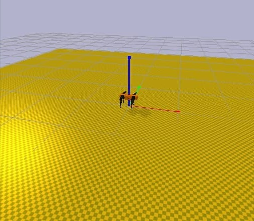
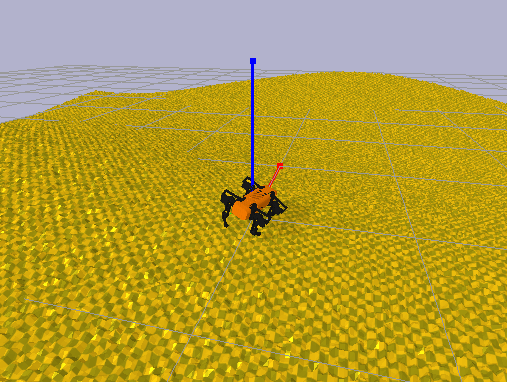
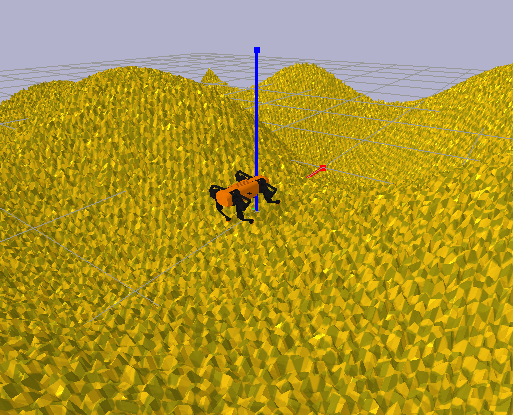
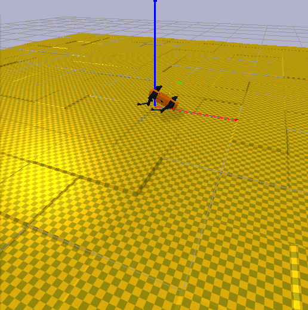
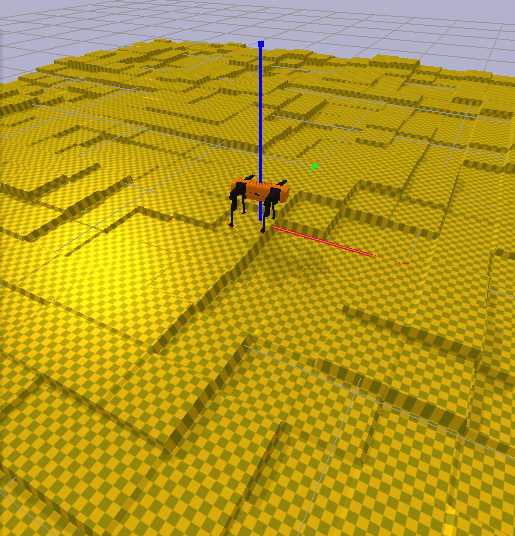
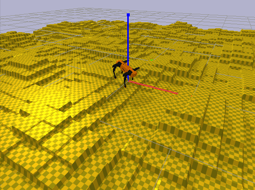
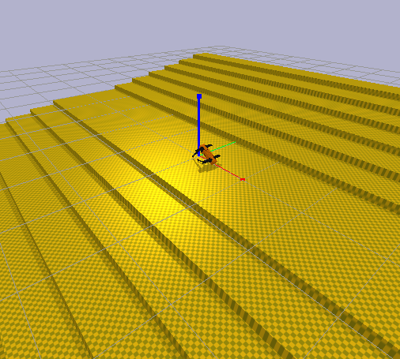
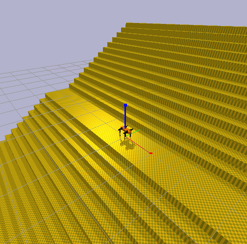

# **Graduation Thesis: GIAdog**

## **Pre-requisitos**

 * `g++ >=8.3.0`
 * `python >=3.7.0`

## **Ejecutar Docker**

```bash
xhost +
sudo docker run \
    --device /dev/dri/ \
    --device /dev/snd \
    --env="QT_X11_NO_MITSHM=1" \
    --ipc=host \
    --net=host \
    --rm \
    -e _JAVA_AWT_WM_NONREPARENTING=1 \
    -e DISPLAY=$DISPLAY \
    -e J2D_D3D=false \
    -it \
    -v /tmp/.X11-unix:/tmp/.X11-unix \
    -v $PWD:/usr/src/open-blacky \
    open-blacky
```

## **Generacion de terrenos**

La generacion de terrenos en una simulacion permite al agente GIAdog aprender a moverse
antes de pasar al robot real. Los terrenos son almacenados como archivos `.txt` que 
contienen una matriz tal que cada posicion indica la altura del terreno en dicho pixel.

### **Hills**

Easy: 0 0.2 0.2

 

Medium: 0.02 1.6 1.6

 

Hard: 0.04 3 3

 

### **Steps** 

Easy: 25, 0.05



Medium 17, 0.23



Hard: 10, 0.4



### **Stairs**

Easy: 50, 0.02

 

Medium: 30, 0.11



Hard: 15, 0.2



## **AUTORES**

 * Amin Arriaga
 * Eduardo Lopez